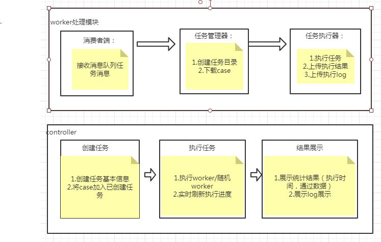
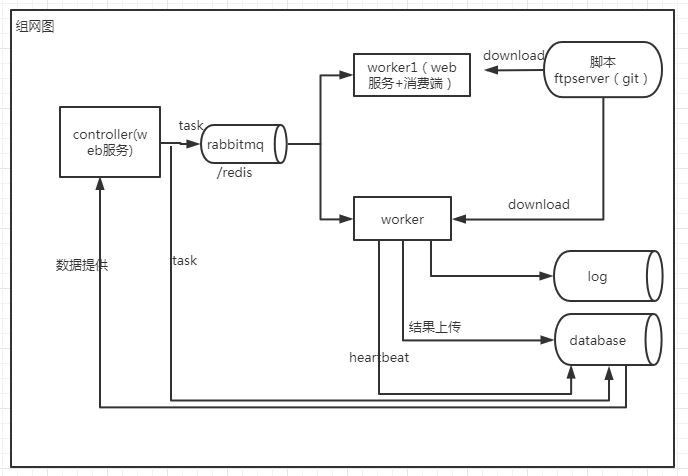
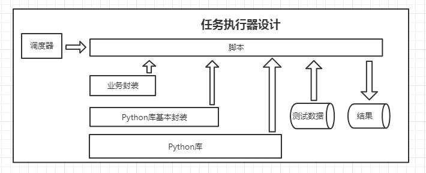

# 自动化测试平台后台代码     
---------------------
app_demo1 接口   
app_demo3 ui Unittest demo    

##相关项目：  
### 流程概要图：
 
### 详细业务流程图：

### 组网图：

### 执行器：

[控制端前台](https://github.com/yangjianj/autotest_ui)   
[worker端](https://github.com/yangjianj/worker)   
[robotframework执行器](https://github.com/yangjianj/ui-api-robotframework) 

## 已实现功能：    
-----
1.用户管理：登录控制，增删改查，角色权限控制---(session cookie,django中间件,装饰器)(完成)    
2.任务创建，任务遍历执行
3.异步/分布式任务执行（redis作为消息中间件）      
3.1测试任务在worker上执行    
3.2worker功能：作为并发测试成员之一执行测试；单独执行部分测试任务     

## 未实现功能：  
1.后台实现接口测试，ui测试，接口性能    
2.页面添加，编辑，执行测试：接口功能测试，性能测试，时间记录---(request，多线程，装饰器)    
3.各版本测试数据统计，图标展示---(mysql,sqlite3,echarts)         
4.失败重试    
5.短信/邮件    
6.日志收集与处理    
7.测试结果展现---（echarts）    
8.多个worker公用资源锁   
9.定时任务   

app_demo1   
========    

### api自动化实现说明：   
    
1.用例管理：excel写用例    
2.执行=》结果校验=》记录存储到数据库    
3.csv比较适合存放测试数据，或数据驱动型用例，不适合步骤多的用例

### 用例：        
1.取excel中测试数据库发送http请求并验证结果    
2.执行api性能测试，设置并发数量，提取返回结果       

app_demo3     
=========    
### 设计说明：        
1.保留app_demo2中yml管理元素的方式，去除excel书写用例用python脚本写用例！！   
2.用例写在unittest中，执行按用例命名规则discover组织suite  
3.输出htmltestrunner文件改进输出到html+存储到数据库（数据已提取待对接mysql）    
4.失败重跑:提取失败用例casename加载重跑

### 用例：   
1.打开页面-点击标签-输入城市值-等待元素出现--ok    
2.获取ul元素子元素个数--遍历子元素下某个标签并输出text--ok     
3.csv中多组数据作为同一方法的输入（ddt）    

### 编码相关：  
1.异常处理在函数内部处理，不在多个函数组合时使用   
2.python导入excel的字符类型种类： 0 --empty,1 --string, 2 --number(都是浮点), 3 --date, 4 --boolean, 5 --error   
3.统一接口数据格式：    
成功:{'status':'success','data':{}};失败:{'status':'fail','message':'失败说明'}

### 问题：
1.分布式执行中slave（通过rabbitmq接收任务）状态监控（非jenkins执行）--python脚本实现主机端口监控--已解决（app_demo1/lib/port_monitor.py）
2.日志文件收集（文件传输）

### 执行结果展示：    
1.UI数据驱动    
1.1[数据驱动_脚本](/app_demo3/testcases/ddt_test/ddt_test_001.py)    
1.2数据驱动_数据    
1.3数据驱动_结果    
2.UI关键字驱动    
2.1[关键字驱动_脚本](/app_demo3/testcases/lianjia/ui_lianjia_test_001.py)     
2.2关键字驱动_结果      
3.API测试    
3.1[API测试_脚本](/app_demo1/lib/backup/runner.py)     
3.2API测试_CASE     
3.3API测试_测试结果     

使用介绍：
1.ui测试：项目ui元素映射文件，+测试脚本    
2.api测试：按一定格式定义测试所需接口文件    

对比：    
本平台与jenkins的master-slave对比：   

### django 命令：  
django-admin startproject HelloWorld    
python manage.py startapp app_name    
python manage.py runserver 0.0.0.0:8090    
python manage.py makemigrations    
python manage.py migrate    

